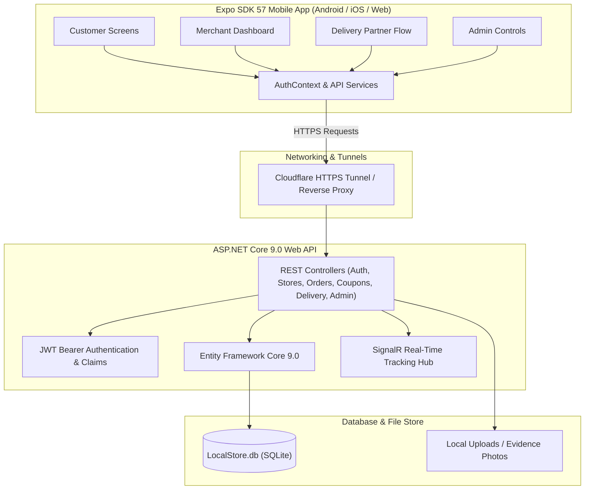
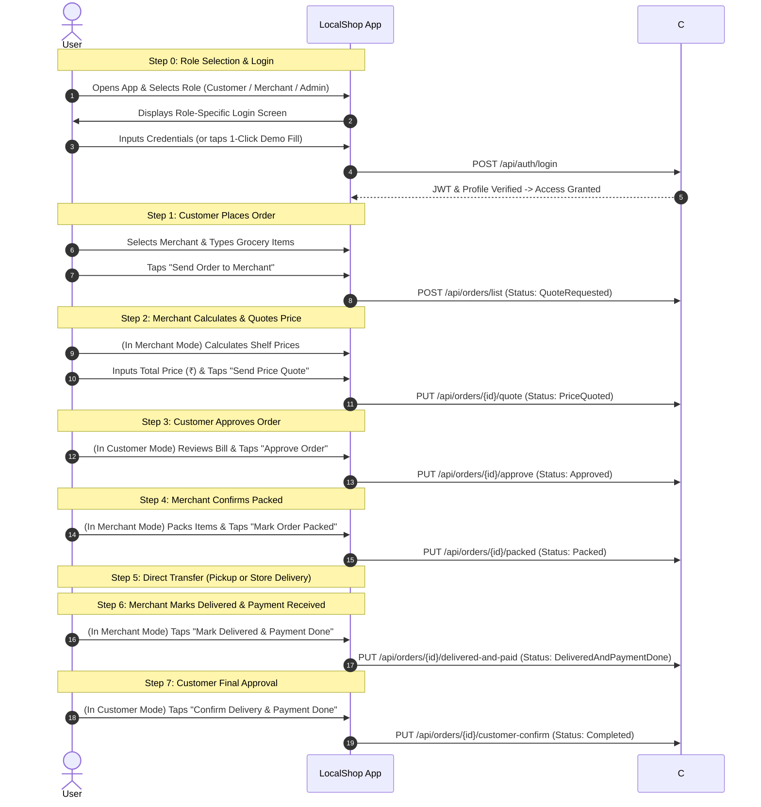
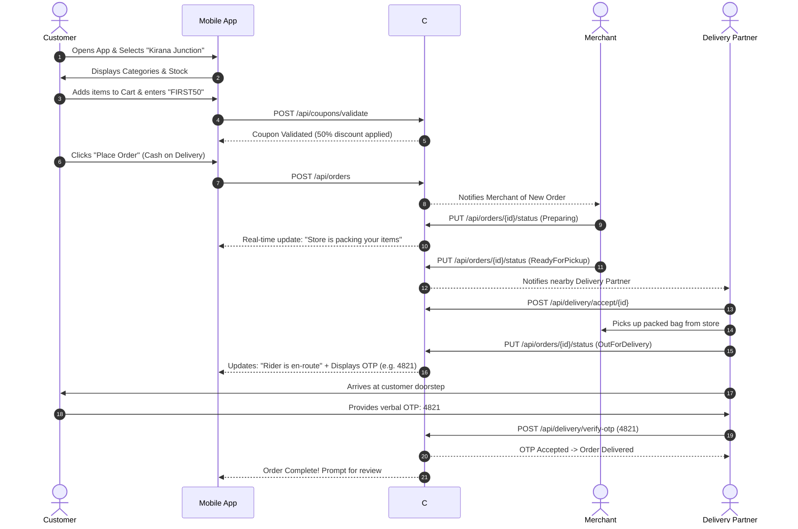

# LocalShop (LocalStore) - Master Application Documentation & User Guide

---

## 1. Executive Summary & Vision

**LocalShop** (internal project name: `LocalStore`) is a hyper-local quick-commerce ecosystem engineered to empower neighborhood mom-and-pop stores (Kirana shops, bakeries, pharmacies, and specialty retailers) to compete directly with centralized quick-commerce platforms like Blinkit, Zepto, and Instamart.

Unlike legacy e-commerce platforms that force small shop owners to digitize thousands of complex SKUs upfront, LocalShop offers a **dual-channel purchasing model**:
1. **Standard Catalog Browsing**: Digital storefront with categories, item descriptions, and stock status.
2. **"Parchi" / Custom Grocery List Ordering**: Customers type a freeform grocery list or upload a handwritten note, which the merchant directly quotes and prices line-by-line.

The platform provides dedicated, role-specific interfaces for four user personas:
* 🛒 **Customer**: Neighborhood shopper ordering everyday essentials.
* 🏪 **Merchant**: Local store owner managing stock, quoting list orders, and fulfilling items.
* 🛵 **Delivery Partner**: Field agent picking up bagged orders and completing delivery via secure OTP handshakes.
* 🛡️ **Administrator**: Platform operator managing merchant KYC, commission rates, and dispute resolution.

---

## 2. Technical Stack & System Architecture



### Technology Matrix
| Layer | Technologies Used | Description |
| :--- | :--- | :--- |
| **Mobile App (Frontend)** | React Native, Expo SDK 57, TypeScript | Single cross-platform codebase supporting Android APK/AAB, iOS, and Web. |
| **Navigation & UI** | React Navigation (Native Stack), React Native Vector Icons, SafeAreaContext | Smooth native page transitions, modal overlays, responsive tabs. |
| **Backend API** | C# .NET 9.0 ASP.NET Core Web API | RESTful backend with dependency injection, middleware pipeline, and logging. |
| **Database & ORM** | SQLite, Entity Framework Core 9.0 | Local portable database with auto-migrated schema and seed data. |
| **Authentication** | JWT (JSON Web Tokens), BCrypt Password Hashing | Role-based access control (`Customer`, `Merchant`, `DeliveryPartner`, `Admin`). |
| **Real-time Services** | SignalR Hubs / Polling fallback | Real-time order progress updates, store open/closed sync, and instant quotes. |
| **External Integrations** | Direct Phone Intent, Google Maps Intent | Direct calling and turn-by-turn GPS navigation. |

---

## 3. Core Role Personas & Access Matrix

| Feature / Screen | Customer | Merchant | Delivery Partner | Administrator |
| :--- | :---: | :---: | :---: | :---: |
| Store Discovery & Search | ✅ | ✅ | ❌ | ✅ |
| Standard Catalog Ordering | ✅ | ❌ | ❌ | ❌ |
| Handwritten List Upload ("Parchi") | ✅ | ❌ | ❌ | ❌ |
| Coupon Application (`FIRST50`, etc.) | ✅ | ❌ | ❌ | ❌ |
| Order Tracking & Delivery Handshake OTP | ✅ | ❌ | ❌ | ❌ |
| Product & Inventory Management | ❌ | ✅ | ❌ | ✅ |
| List-Order Quotation & Pricing | ❌ | ✅ | ❌ | ❌ |
| Order Preparation & Dispatch | ❌ | ✅ | ❌ | ❌ |
| Order Acceptance & Turn-by-Turn GPS | ❌ | ❌ | ✅ | ❌ |
| Customer Drop-off Handshake Verification | ❌ | ❌ | ✅ | ❌ |
| Merchant KYC & Onboarding Approval | ❌ | ❌ | ❌ | ✅ |
| System Auditing & Platform Metrics | ❌ | ❌ | ❌ | ✅ |

---

## 4. Screen-by-Screen Breakdown & Use Cases

### 4.1 Customer Persona Screens

#### 1. Authentication & Welcome (`LoginScreen` / `RegisterScreen`)
* **Purpose**: Authenticates registered users or onboards new customers with phone number verification.
* **Key Elements**:
  * Phone Number and Password inputs.
  * Role selection switch (Customer, Merchant, Delivery).
  * Fast-fill demo buttons for quick evaluation (`Demo Customer`, `Demo Merchant`, `Demo Rider`, `Demo Admin`).
  * "Remember Me" toggle with secure local token persistence.

#### 2. Discovery & Home Screen (`HomeScreen`)
* **Purpose**: Primary dashboard for customers to find nearby verified stores and current deals.
* **Key Elements**:
  * **Top Location Bar**: Current neighborhood or delivery address selector.
  * **Quick Filter Badges**: Categories like *Groceries*, *Dairy & Eggs*, *Snacks*, *Beverages*, *Pharmacy*, *Personal Care*.
  * **Store Cards**: Displays Store Name, banner image, average rating (e.g., ⭐ 4.8), distance (e.g., 0.8 km), and estimated delivery time (e.g., 15-25 mins).
  * **Promotional Banner Carousel**: Showcases active discount codes (`FIRST50` - 50% off first order).

#### 3. Store Front & Ordering Screen (`StoreScreen`)
* **Purpose**: Dual-mode shopping screen allowing catalog selection or custom grocery list submission.
* **Key Elements**:
  * **Store Header**: Store contact info, operating hours, delivery radius, and minimum order threshold.
  * **Tab 1: Digital Catalog**:
    * Search bar with real-time text matching.
    * Category accordion tabs.
    * Product tiles with high-res images, pricing (MRP vs Discounted Price), and quantity steppers (`-`, `qty`, `+`).
  * **Tab 2: "Order via List" (Custom Parchi Mode)**:
    * Text area for pasting or typing multi-line grocery lists (e.g., "1kg Aashirvaad Atta, 500g Amul Butter, 2 packets Maggi").
    * Photo attachment button to snap a picture of a handwritten notepad.
    * Submit button that dispatches the list to the merchant for custom quotation.

#### 4. Cart & Checkout (`CartScreen`)
* **Purpose**: Review selected items, apply discounts, choose delivery address, and place order.
* **Key Elements**:
  * **Item Summary**: Item breakdown with individual and cumulative totals.
  * **Promo Code Module**: Input box supporting instant validation for codes like `FIRST50`, `KIRANA10`, and `FLAT20`.
  * **Delivery Fee Calculation**: Dynamic distance-based fee with threshold for free delivery.
  * **Payment Options**: Cash on Delivery (COD), UPI Mock Gateway, and Net Banking/Cards.
  * **"Place Order" Button**: Creates order record and triggers real-time notification to the merchant.

#### 5. Live Order Tracking (`OrderTrackingScreen`)
* **Purpose**: Real-time status visibility from shop confirmation to front-door dropoff.
* **Key Elements**:
  * **Dynamic Status Timeline**:
    * 🟡 `Pending` (Awaiting Store Acceptance)
    * 🟠 `Preparing` (Store packing goods)
    * 🔵 `ReadyForPickup` (Assigned to rider)
    * 🟣 `OutForDelivery` (Rider en-route)
    * 🟢 `Delivered` (Completed)
  * **4-Digit Handshake OTP Banner**: Secure code (e.g., `4821`) that the customer must verbally provide to the rider before goods are handed over.
  * **Direct Contact Option**: Call merchant or partner directly from the order card.
  * **Real-time Approval & Handshake**: Direct one-tap approval and order confirmation without third-party messaging apps.

---

### 4.2 Merchant Persona Screens

#### 1. Merchant Dashboard (`MerchantDashboardScreen`)
* **Purpose**: Central operational hub for the store owner.
* **Key Elements**:
  * **Today's Metric Tiles**: Daily Sales GMV (₹), Total Orders, Pending Quotations, Completed Deliveries.
  * **Store Status Toggle**: Instant `Open` / `Closed` switch to pause incoming orders.
  * **Order Pipeline Feed**: Filterable tabs for `Incoming`, `In Progress`, and `Past Orders`.

#### 2. Catalog & Inventory Management (`InventoryScreen`)
* **Purpose**: Manage products, adjust prices, and toggle in-stock / out-of-stock items.
* **Key Elements**:
  * **Add Product Modal**: Upload product picture, enter title, SKU, category, cost price, and retail price.
  * **Stock Stepper**: Quick increment/decrement buttons for quick physical counts.
  * **Instant Stock Toggle**: Switch to mark sold-out items so customers cannot order them.

#### 3. Custom List Order Quotation Screen (`MerchantQuoteScreen`)
* **Purpose**: Review customer-submitted handwritten or typed grocery lists and supply prices.
* **Key Elements**:
  * Side-by-side view of the customer's text list or scanned paper note.
  * Dynamic line-item inputs where the merchant fills in product availability and price.
  * "Send Quote to Customer" action button. The customer receives a notification to approve or reject the final total.

#### 4. Order Fulfillment & Dispatch Screen
* **Purpose**: Advance orders through physical fulfillment steps.
* **Key Elements**:
  * Printable / viewable packing checklist with checkboxes.
  * "Order Packed & Ready" button: Alerts nearby available delivery riders for pickup.

---

### 4.3 Delivery Partner Persona Screens

#### 1. Rider Availability & Deliveries Queue (`DeliveryPartnerScreen`)
* **Purpose**: Field dashboard for riders to claim, inspect, and fulfill deliveries.
* **Key Elements**:
  * **Duty Toggle**: `Online` (accepting jobs) / `Offline` (resting).
  * **Available Deliveries Feed**: Card showing pickup merchant address, customer drop-off distance, estimated delivery fee earned, and item count.
  * **"Accept Delivery" Button**: Locks the order to the rider and reveals customer address details.

#### 2. Turn-by-Turn Routing & Customer Communication
* **Purpose**: Safe and fast transit to the merchant and customer.
* **Key Elements**:
  * **"Navigate with Google Maps" Button**: Launches native Google Maps with coordinates pre-populated.
  * **Customer Contact Card**: Masked calling button and in-app chat for gate codes or landmark clarification.

#### 3. Secure Handshake Verification Modal
* **Purpose**: Guarantees goods are delivered to the authorized person and prevents false disputes.
* **Key Elements**:
  * 4-digit numeric pin pad.
  * Real-time verification against backend `DeliveryOtp` hash.
  * Photo proof upload (optional landmark dropoff confirmation).
  * "Complete Delivery" button: Releases delivery partner payout and marks order `Delivered`.

---

### 4.4 Administrator Persona Screens

#### 1. Platform Operations Dashboard (`AdminDashboardScreen`)
* **Purpose**: High-level platform health monitoring.
* **Key Elements**:
  * Aggregate Gross Merchandise Value (GMV), Active Users, Verified Stores, Active Delivery Fleet.
  * System health indicators (API response times, database size, error log count).

#### 2. Merchant Verification & KYC Portal
* **Purpose**: Ensures only legitimate local businesses operate on the network.
* **Key Elements**:
  * Review merchant business registration, FSSAI license (food safety), and address proof.
  * One-click `Approve Store` or `Reject with Reason` actions.

#### 3. Dispute & Settlement Oversight
* **Purpose**: Review cancelled orders, manage customer refunds, and audit merchant payouts.
* **Key Elements**:
  * Audit trail of timestamped order events.
  * Manual override tool for canceled order compensations.

---

## 5. End-to-End User Guides & Workflows

### 5.1 Streamlined Role Selection, Login & Direct Workflow (Current Active App Experience)

The application provides a clean, role-gated onboarding journey:

1. **Role Selection Landing Screen**: When launching the app, the user chooses who they are:
   * 🛒 **Customer**: Neighborhood shopper ordering essentials.
   * 🏪 **Store Owner (Merchant)**: Local retailer quoting prices and fulfilling orders.
   * 🛡️ **Administrator**: Platform operator overseeing stores and metrics.
2. **Dedicated Login Screen**:
   * The user enters their phone/key and password to log in.
   * **1-Tap Quick Fill Demo Buttons** are provided on all login screens for rapid evaluation:
     * Customer: Rahul Sharma (`9876543210` / `Customer@2026!`)
     * Merchant: Kirana Junction (`9876500000` / `Merchant@2026!`)
     * Admin: Super Admin (`superadmin` / `Admin@2026!`)
3. **Streamlined Post-Login Experience**:
   * **Customer**: Selects merchant, writes/adds grocery items, places order, reviews & approves price quote, tracks packing status, and confirms delivery & payment completion.
   * **Merchant**: Live store open/closed status toggle banner (`[Open Shop 🟢]` / `[Close Shop 🔴]`) to control whether the shop is actively accepting orders, receives incoming customer grocery lists, calculates shelf prices with the built-in calculator, sends price quotes, marks orders packed, and marks orders delivered & paid.
   * **Admin**: Accesses root metrics and store KYC verifications.
   * **Role Switching**: A prominent **"← Switch Role"** button at the top header allows logging out and switching personas at any time.



---

### 5.2 Advanced Multi-Role Journey (Preserved for Future Fleet Activation)



---

### 5.2 Customer "Parchi" / Custom Grocery List Journey

1. **Step 1: Compose List**: Customer taps the **Order via List** tab on the store screen.
2. **Step 2: Input Choices**:
   * *Option A*: Type line items into the structured text editor (e.g., `1. Fortune Sunflower Oil 1L`, `2. Tata Salt 1kg`, `3. Good Day Biscuits 2 packs`).
   * *Option B*: Take a photo of a physical handwritten paper slip.
3. **Step 3: Submit**: Tap **Send List to Store**.
4. **Step 4: Merchant Quotation**: The merchant receives the list on their dashboard, checks shelf availability, types the unit prices, and clicks **Dispatch Quote**.
5. **Step 5: Review & Checkout**: The customer receives a push alert: *"Kirana Junction sent a quotation of ₹340 for your list"*. The customer reviews itemized prices, applies any coupons, and clicks **Accept & Pay**.

---

### 5.3 Delivery Handshake Workflow

To eliminate fraud, disputes, or missing package claims, LocalShop enforces a **Cryptographic OTP Handshake**:
1. When an order transitions to `OutForDelivery`, the C# backend generates a randomized 4-digit code (e.g., `5912`).
2. This code is shown **only** on the Customer's `OrderTrackingScreen` inside a high-contrast security badge.
3. The Delivery Partner arrives at the customer's doorstep and requests the code.
4. The rider inputs the code into the mobile app.
5. The API verifies the code against the database. If correct, the order transitions to `Delivered`, the merchant's escrow balance updates, and the rider's delivery fee is credited.

---

## 6. Pre-Configured Demo Accounts & Testing Credentials

The SQLite database (`LocalStore.db`) comes pre-seeded with complete test scenarios:

| Persona | Username / Phone | Password | Associated Profile / Notes |
| :--- | :--- | :--- | :--- |
| 🛒 **Customer** | `9876543210` | `Customer@2026!` | Rahul Sharma (Indiranagar, Bangalore) |
| 🏪 **Merchant** | `9876500000` | `Merchant@2026!` | Kirana Junction (Store ID: 1) |
| 🛵 **Delivery Rider 1** | `delivery001` | `Delivery@2026!` | Rohan Das (Hero Splendor, 4.9⭐) |
| 🛵 **Delivery Rider 2** | `delivery002` | `Delivery@2026!` | Aman Verma (Honda Activa, 4.8⭐) |
| 🛡️ **Platform Admin** | `superadmin` | `Admin@2026!` | Full administrative clearance |

### Active Demo Promo Codes
* **`FIRST50`**: 50% discount on first-time orders (capped at ₹100).
* **`KIRANA10`**: Flat 10% discount on orders above ₹300.
* **`FLAT20`**: Flat ₹20 off on grocery orders above ₹150.

---

## 7. Developer & Tester Operations Guide

### 7.1 Running the Backend API Locally
```powershell
# Navigate to the API folder
cd "c:\PM Project\LocalStore\LocalShop.Api"

# Ensure all database migrations are applied
dotnet ef database update

# Run the API on Port 5000
dotnet run --urls "http://0.0.0.0:5000"
```
* Swagger UI documentation: `http://localhost:5000/swagger`

### 7.2 Exposing API for Mobile Devices via Cloudflare Tunnel
Because modern Android versions (Android 9+) block plain HTTP (`CLEARTEXT_NOT_PERMITTED`), remote physical devices must connect via an encrypted HTTPS URL:
```powershell
cloudflared tunnel --url http://127.0.0.1:5000
```
Update `apiConfig.ts` with the generated URL:
```typescript
export const API_BASE_URL = 'https://<your-cloudflare-subdomain>.trycloudflare.com/api';
```

### 7.3 Running the Mobile App (Local Development)
```powershell
# Navigate to the mobile app folder
cd "c:\PM Project\LocalStore\UI\local-shop-app"

# Install dependencies (respecting peer dependencies)
npm install --legacy-peer-deps

# Start Expo dev server
npx expo start --clear
```

### 7.4 Downloading & Testing the Standalone Android APK
* **Direct Download Link**: [Download LocalShop APK v1.0.0](https://expo.dev/artifacts/eas/eA3ZlHhgdzmL_U_I5Qfq9PKJ5b0jKX-H_7rHpZmApZU.apk)
* **Build Details & QR Code**: [Expo EAS Build Dashboard](https://expo.dev/accounts/puspendu_dev/projects/local-shop-app/builds/b0481fb5-de69-476c-93ec-306d84a4803d)

---

## 8. Summary of Completed System Hardening

1. **Expo SDK 57 Upgrade**: Updated all native dependencies including `react-native 0.86.3`, `react-native-reanimated 4.5.1`, and `react-native-screens 4.27.0`.
2. **TypeScript Compilation**: Fixed typing mismatches across all order tracking and delivery screens.
3. **Android Security Compliance**: Replaced raw IP HTTP requests with SSL-terminated HTTPS endpoints to prevent Android cleartext network blocks.
4. **Multi-Role Seed Dataset**: Verified database seeding with 4 role personas, active store inventories, and promotional coupons.
