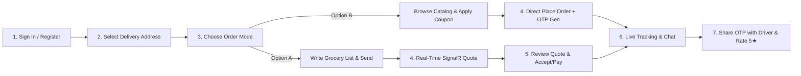
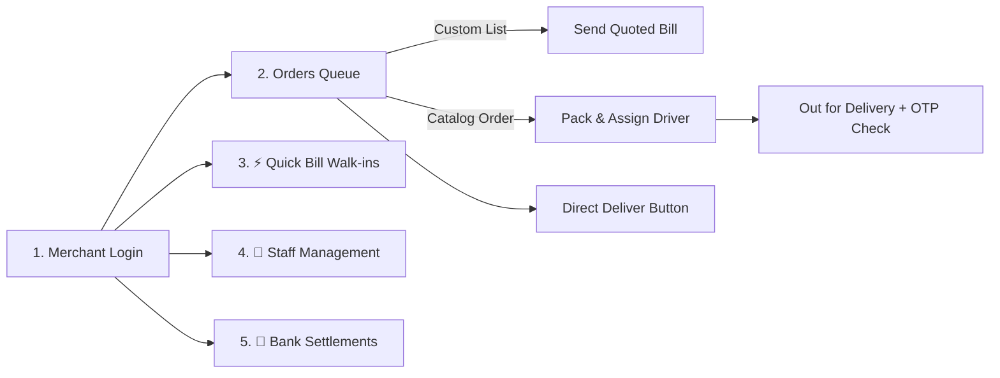
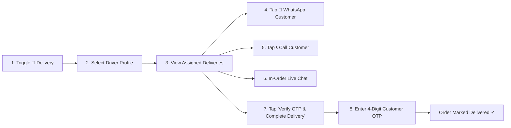

# LocalStore: Multi-Persona User Guide (Phase 4 Edition)

A comprehensive step-by-step operational manual for navigating, testing, and operating the **LocalStore** hyperlocal commerce application across all four user personas: **Customer**, **Merchant**, **Delivery Partner**, and **Administrator**.

---

## 🚀 Quick Access & Test Credentials

| Detail | Access Point / Value |
| :--- | :--- |
| **Frontend Web App** | [http://localhost:8081](http://localhost:8081) |
| **Mobile Expo Go Tunnel** | `exp://192.168.29.19:8081` (same Wi-Fi network) |
| **Backend API Host** | [http://localhost:5000](http://localhost:5000) |
| **Real-Time SignalR Hub** | [http://localhost:5000/hubs/orders](http://localhost:5000/hubs/orders) |
| **Database Engine** | SQLite `LocalStore.db` (WAL mode enabled, 30s busy timeout) |
| **Customer Default Mobile** | `9876543210` (Password: set at registration, e.g. `pass123`) |
| **Merchant Store Default** | `Tarama Stores` (Phone: `9876500000`) |
| **Delivery Driver Profile** | `Rohan Das` (Phone: `9876500001`) • `Aman Verma` (Phone: `9876500002`) |
| **Admin Master Credentials** | Admin Key: `superadmin` • Password: `admin123` |
| **Seeded Promo Coupons** | `FIRST50` (Flat ₹50 Off) • `KIRANA10` (10% Off) • `FLAT20` (Flat ₹20 Off) |

> [!NOTE]
> **Database Concurrency & Live Inspection:**
> The SQLite database uses Write-Ahead Logging (`PRAGMA journal_mode = WAL;`) and a 30-second busy timeout. You can safely inspect, query, and run SQL commands against `LocalStore.db` in **DB Browser for SQLite** while the web app, C# backend, and mobile devices are simultaneously transacting without encountering `database is locked` errors.

---

## 🕹️ The Matrix Console Switcher

At the top of the application screen sits the **LocalShop Matrix Console**:

```
+---------------------------------------------------------------------------------------+
|                               LocalShop Matrix Console                                |
|        [ Customer ]   [ Merchant ]   [ 🛵 Delivery (New) ]   [ Admin ]                |
+---------------------------------------------------------------------------------------+
```

You can tap any of the four role buttons at any time to instantly switch perspectives between the **Customer**, the **Shopkeeper (Merchant)**, the **Delivery Partner**, and the **System Administrator** within the same browser or mobile session.

---

## 👤 Persona 1: Customer User Guide

As a customer, you can browse neighborhood stores, order groceries either by typing a freeform list or choosing standard products, manage multiple delivery addresses, apply discount coupons, communicate directly with shopkeepers via **WhatsApp** and **In-Order Live Chat**, track delivery progression with 4-digit **Delivery OTP verification**, and submit **5-star ratings and reviews**.



### Step 1: Register or Sign In
1. Toggle the top role to **Customer**.
2. If logging in for the first time:
   * Tap **"Create Account"** $\rightarrow$ enter your **Full Name**, **Mobile Number**, **Password**, and **Delivery Address** $\rightarrow$ tap **"Sign Up"**.
   * Your password is securely hashed via SHA-256 and stored in SQLite `Users`.
3. If already registered, enter your 10-digit mobile and password, then tap **"Sign In"**.

### Step 2: Select or Add Delivery Addresses
1. On the **🛍️ Shop** tab, notice the top delivery banner: `Delivering to: Flat 4B, Greenfield Apartments`.
2. Tap **"Change"** to open the **Saved Addresses Modal**:
   * Choose between saved addresses tagged with `🏠 Home`, `🏢 Work`, or `📍 Other`.
   * Or type a new address line, choose a tag pill, and tap **"Save and Use Address"**.
   * Persisted in SQLite `CustomerAddresses` (`/api/customers/{phone}/addresses`).

### Step 3: Browse Neighborhood Stores & Inquire via WhatsApp
1. Tap any store pill in the top carousel (`Tarama Stores`, `Daily Fresh Organics`, `Sharma Dairy & Provisions`).
2. View live operating hours, delivery radius, customer rating, and open/closed status.
3. Tap **"💬 WhatsApp"** on the store banner to open WhatsApp (`https://wa.me/919876500000`) with prefilled greeting to ask about item availability before placing an order.

### Step 4: Choose Your Ordering Mode
* **Mode A: Freeform Grocery List (Zero Inventory Required)**
  1. Tap **"📝 Write Grocery List"**.
  2. Tap quick-add essential chips (`+ Amul Milk`, `+ Atta 1kg`, `+ Eggs 6 pcs`) or type items freely in the text box.
  3. Tap **"Send List for Price Quote"**.
  4. Order is dispatched to the merchant with status `QuoteRequested`.
* **Mode B: Standard Product Catalog with Coupons & Auto-Stock Decrement**
  1. Tap **"🛍️ Browse Catalog"**.
  2. Search items or filter by category (`Groceries`, `Dairy`, `Bakery`).
  3. Tap **"Add"** or use `+` / `-` stepper buttons.
  4. In the cart bar, enter a promo coupon:
     * Type `FIRST50` or tap the quick coupon chip `🏷️ FIRST50 (₹50 OFF)` $\rightarrow$ tap **"Apply"**.
     * Real-time coupon validator (`POST /api/coupons/validate`) checks min order amount and deducts ₹50 instantly.
  5. Tap **"Submit Order"**.
  6. SQLite `Products` table decrements stock automatically, and a unique 4-digit **Delivery OTP** is generated.

### Step 5: Live Order Tracking, OTP Banner & In-Order Chat
1. Switch to the **📦 Track** sub-tab:
   * **Price Quote Alert:** If you submitted a grocery list, the shopkeeper's quoted price card will appear automatically via SignalR without refreshing. Tap **"Accept Quote & Pay"** to select Cash on Delivery or instant UPI.
   * **Delivery Confirmation Code (OTP):** Prominently displays `🔑 Delivery Confirmation Code: 4829`. Keep this 4-digit OTP ready to share with the delivery driver upon arrival.
   * **Driver Details:** Displays assigned delivery partner name and phone.
   * **In-Order Live Chat:** Tap **"Order Chat"** to open a real-time messaging thread with the merchant and delivery driver.
   * **WhatsApp Store:** Tap **"💬 WhatsApp Store"** to open a WhatsApp thread with your order number and item summary pre-populated.

### Step 6: Post-Delivery 5-Star Rating & Store Review
1. Once the driver verifies your 4-digit OTP, your order status automatically changes to `Delivered`.
2. Tap the gold button: **"⭐ Rate Experience & Delivery"**.
3. Select 1 to 5 stars, type your review comment (e.g. *"Fast delivery, fresh milk packets! 5/5"*), and tap **"Submit Review"**.
4. Rating is saved to `Orders` table (`PUT /api/orders/{id}/rate`) and displayed on your completed order card.

---

## 🏪 Persona 2: Merchant / Shopkeeper User Guide

As a merchant, you can fulfill customer grocery lists, punch counter quick sales, assign delivery drivers, chat with customers, and request payouts.



### Step 1: Manage Orders & Price Quotes
1. Toggle to **Merchant** $\rightarrow$ **📦 Stock** $\rightarrow$ **"Orders"** tab.
2. When a customer sends a grocery list, review their text items. Enter your total shelf price in the `Total Bill (₹)` field and tap **"Send Bill"**.
3. SignalR pushes the price quote directly to the customer's phone in real time.

### Step 2: Assign Delivery Drivers
1. When an order is confirmed (`Processing`), tap **"🛵 Assign Driver"**.
2. An active delivery driver modal pops up listing your registered staff (e.g. `Rohan Das`, `Aman Verma`).
3. Select a driver. The order status updates immediately to `Out for Delivery`, the driver is notified, and their name is bound to the order record.

### Step 3: Merchant-to-Customer WhatsApp & Live Chat
1. Tap **"💬 WhatsApp Customer"** on any order card to launch WhatsApp with a pre-composed message containing the order ID, total bill amount, and delivery verification OTP.
2. Tap **"Order Chat"** to send immediate chat messages about item substitutions or packing updates.

### Step 4: Quick Counter Billing (Zero Inventory Needed)
1. Tap **"⚡ Quick Bill"**.
2. Enter the customer's name, mobile number, item description, and total sale amount (e.g., ₹250).
3. Select **Cash** or **UPI**, and tap **"Record Sale & Collect Payment"**.
4. Sale is committed directly to the SQLite `Orders` ledger without requiring catalog setup.

### Step 5: Staff Management & Payout Requests
1. Tap **👥 Staff** to add, toggle active/inactive, or remove delivery drivers and counter clerks.
2. Tap **🏦 Bank** to view your real-time withdrawable balance and dispatch payout transfers.

---

## 🛵 Persona 3: Delivery Partner User Guide (New in Phase 4)

The **Delivery Partner Console** provides a purpose-built mobile interface for delivery drivers on the road.



### Step 1: Switch to Delivery Mode & Select Driver Profile
1. In the Matrix Console header, tap **"🛵 Delivery"**.
2. The Delivery Console loads with driver selector pills:
   * `🛵 Rohan Das (9876500001)`
   * `🛵 Aman Verma (9876500002)`
   * `🛵 All Active Drivers`
3. Select your name to view orders assigned specifically to you.

### Step 2: Active Delivery Queue & Directions
1. Each active order card displays:
   * Order ID & Store Name (`Tarama Stores`)
   * Customer Name & Mobile Number
   * Complete Delivery Address with `📍` navigation pin
   * Total Bill Amount and Payment Mode (`Cash on Delivery` / `UPI Prepaid`)
   * Number of items and requested grocery lines

### Step 3: Contacting the Customer on Route
1. **WhatsApp Direct Connect:** Tap **"💬 WhatsApp Customer"** to launch WhatsApp with a pre-written message:
   `"Hello [Name]! I am your delivery partner for LocalStore Order #[ID]. I am en route with your items. Please keep Delivery OTP ready."`
2. **Direct Phone Call:** Tap **"📞 Call Customer"** to trigger native phone dialer.
3. **In-Order Chat:** Tap **"Chat"** to coordinate gate entry, building codes, or contactless drop-offs.

### Step 4: OTP Verification & Delivery Completion
1. When you arrive at the customer's doorstep, request their **4-Digit Delivery Code**.
2. Tap the large green button: **"🔑 Verify OTP & Complete Delivery"**.
3. A numeric PIN keypad modal opens.
4. Enter the 4-digit code provided by the customer:
   * If an incorrect code is entered (e.g. `0000`), an alert rejects the verification: *"Invalid delivery OTP code. Please ask customer to check their Track screen."*
   * If the correct code is entered, the order is verified against SQLite, marked `Delivered`, and moved to the completed deliveries section.
5. SignalR broadcasts the delivery event to both the customer and merchant screens instantly!

---

## 🛡️ Persona 4: System Administrator User Guide

The System Administrator oversees ecosystem health, verifies merchant licenses, audits security logs, and manages platform commission rules.

### Accessing the Admin Console
1. Toggle top role to **Admin**.
2. Enter root credentials:
   * **Admin Key:** `superadmin`
   * **Password:** `admin123`
3. Tap **"Authenticate as Admin"**.

### Admin Management Tabs:
* **APPROVALS:** Approve or reject merchant store registrations and verify trade licenses.
* **CUSTOMERS:** Review customer accounts and toggle `Active` vs `Flagged` status.
* **REPORTS:** Real-time Gross Merchandise Volume (GMV), total orders, platform commission collected, and merchant settled balances.
* **LOGS:** Immutable audit ledger tracking settlements, admin logins, and store status changes.
* **CONFIG:** Adjust global transaction fee percentage (e.g. `2.5%`) and toggle Emergency Maintenance Mode.

---

## 🔌 Complete API & SignalR Hub Reference

| Method / Protocol | Route | Target Persona | Purpose & Database Impact |
| :--- | :--- | :--- | :--- |
| `POST` | `/api/auth/register` | Customer | Provisions customer in `Users` with SHA-256 hashed password. |
| `POST` | `/api/auth/login` | Customer | Authenticates phone and password against `Users` table. |
| `GET` / `POST` | `/api/customers/{phone}/addresses` | Customer | Fetches and saves multiple customer delivery addresses (`Home`, `Work`, `Other`). |
| `GET` | `/api/stores` | Customer | Retrieves neighborhood stores with live Open/Closed status, rating, and hours. |
| `GET` | `/api/coupons` | Customer / Admin | Returns active discount coupons (`FIRST50`, `KIRANA10`, `FLAT20`). |
| `POST` | `/api/coupons/validate` | Customer | Validates coupon against min order amount and computes discount. |
| `POST` | `/api/orders/custom-list` | Customer | Creates uncataloged grocery list order (`QuoteRequested`). |
| `POST` | `/api/orders/catalog` | Customer | Creates itemized order with coupon discount; generates 4-digit `DeliveryOtp`. |
| `GET` | `/api/orders` | All Personas | Retrieves orders filtered by status, store, or driver. |
| `PUT` | `/api/orders/{id}/quote` | Merchant | Dispatches shelf price quote; triggers real-time SignalR push. |
| `PUT` | `/api/orders/{id}/accept-quote` | Customer | Accepts quote and selects payment method (`Processing`). |
| `PUT` | `/api/orders/{id}/assign-driver` | Merchant | Binds delivery driver to order and sets status to `Out for Delivery`. |
| `PUT` | `/api/orders/{id}/verify-otp-deliver`| Delivery Partner | Verifies 4-digit customer OTP and marks order `Delivered`. |
| `PUT` | `/api/orders/{id}/rate` | Customer | Saves 1-5 star rating and customer review comment. |
| `GET` / `POST` | `/api/orders/{id}/messages` | All Personas | Stores and returns in-order chat message thread. |
| `GET` | `/api/orders/{id}/whatsapp-link` | All Personas | Generates universal `https://wa.me/` deep link with prefilled order text. |
| `POST` | `/api/orders/quick-bill` | Merchant | Logs counter walk-in sale with zero inventory records required. |
| `PUT` | `/api/orders/{id}/cancel` | Customer | Cancels order, triggers refund, and restocks catalog items in `Products`. |
| `GET` / `POST` | `/api/staff` | Merchant | Manages delivery drivers and store staff members. |
| `GET` / `POST` | `/api/settlements/...` | Merchant | Checks ledger balance and dispatches bank payouts. |
| `GET` / `PUT` | `/api/admin/...` | Admin | Manages KYC approvals, customer compliance, audit logs, and GMV reports. |
| `WebSocket` | `/hubs/orders` | All Personas | SignalR hub for real-time price quotes, status updates, and order chat. |

---

## 🔄 4-Persona End-to-End Simulation Walkthrough

Follow this 2-minute walkthrough to experience the entire Phase 4 workflow across all four personas:

| Step | Persona | Action | Result |
| :---: | :---: | :--- | :--- |
| **1** | **Customer** | In **🛍️ Shop** $\rightarrow$ **"🛍️ Browse Catalog"**, add items to cart, type `FIRST50`, tap **"Apply"**, and tap **"Submit Order"**. | Order placed with ₹50 discount. Stock decrements. 4-digit Delivery OTP is generated! |
| **2** | **Merchant** | Toggle to **Merchant** $\rightarrow$ **"Orders"**, see order confirmed (`Processing`). Tap **"Assign Driver"** $\rightarrow$ choose **Rohan Das**. | Order status updates to `Out for Delivery`. Rohan Das is assigned as driver. |
| **3** | **Delivery** | Toggle to **🛵 Delivery** $\rightarrow$ select **Rohan Das**. Tap **"💬 WhatsApp Customer"** or **"Chat"**. | WhatsApp / In-Order chat opens with customer with order details and arrival notification. |
| **4** | **Customer** | Toggle to **Customer** $\rightarrow$ **"📦 Track"**. Check the gold banner: `🔑 Delivery Code: [OTP]`. | Customer sees their 4-digit code and assigned driver name. |
| **5** | **Delivery** | Toggle to **🛵 Delivery**, tap **"🔑 Verify OTP & Complete Delivery"**, enter the customer's 4-digit OTP. | OTP verified! Order marked `Delivered` across all screens instantly. |
| **6** | **Customer** | Toggle to **Customer** $\rightarrow$ **"📦 Track"**, tap **"⭐ Rate Experience"**, select 5 stars, leave review. | Store review and 5-star rating saved permanently to SQLite! |
| **7** | **Admin** | Toggle to **Admin** (`superadmin` / `admin123`), check **REPORTS** and **LOGS**. | Updated ecosystem GMV, platform commission, and audit logs verified. |

---
